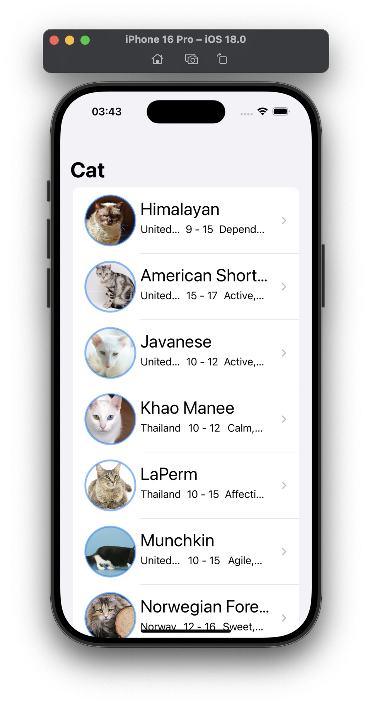
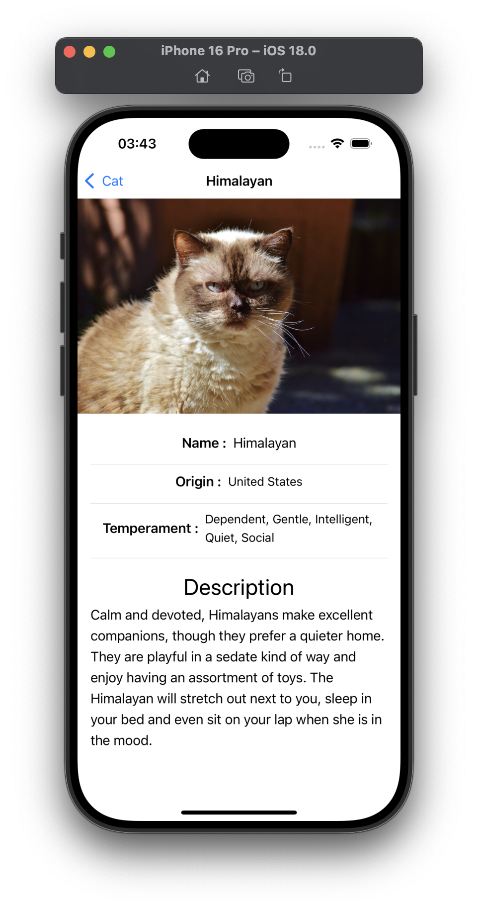

# TheCatApi-Paging-Caching.iOS

TheCatApi-Paging-Caching.ios is an iOS application that interacts with TheCatApi to fetch and display images of cats. The app implements paging to load cat images efficiently and caches the data for offline access.

## Features

- **Cat Image Listing**: Displays a list of cat images fetched from TheCatApi.
- **Paging**: Implements infinite scrolling to load more cat images as the user scrolls down.
- **Caching**: Saves fetched cat images locally to improve performance and allow offline access.
- **Cat Detail View**: Displays details of each cat image when tapped.
    
## Technology Used

- **SwiftUI** for building the user interface
- **Combine** for reactive programming
- **URLSession** for networking
- **TheCatApi** for fetching cat images and breed information
- **NSCache** for local caching

## Screenshots

| List Screen                          | Detail Screen                             |
|------------------------------------------|-----------------------------------------------|
|  |  |


## How It Works

1. The app fetches cat images from TheCatApi using URLSession.
2. The data is displayed in a paginated list, allowing users to scroll through a collection of images.
3. The app caches images locally to improve performance and reduce the number of API requests.
4. Tapping on a cat image opens a detailed view showing more information about the cat's breed.

## API Key Setup

To run this application, you will need an API key from [The Cat API](https://thecatapi.com/).

1. Get your API key from [The Cat API](https://thecatapi.com/).
2. Add the API key in the `Secrets.example.plist` file:
   ```
   API_KEY=your_api_key_here
   ```
 3. Rename Secrets.example.plist -> Secrets.plist

## Contributing

Feel free to contribute by opening issues or submitting pull requests. Please ensure you follow the project's code style and guidelines.

## License

This project is licensed under the MIT License. See the [LICENSE](LICENSE) file for details.

